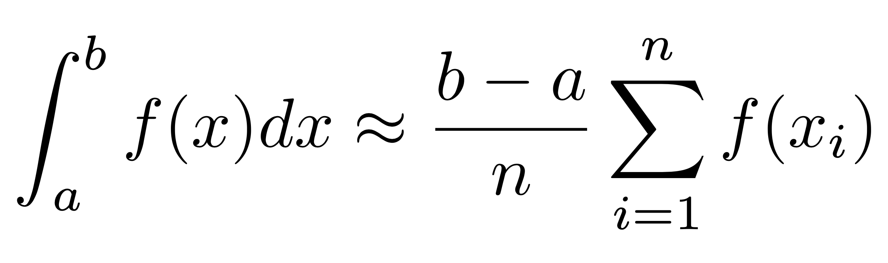
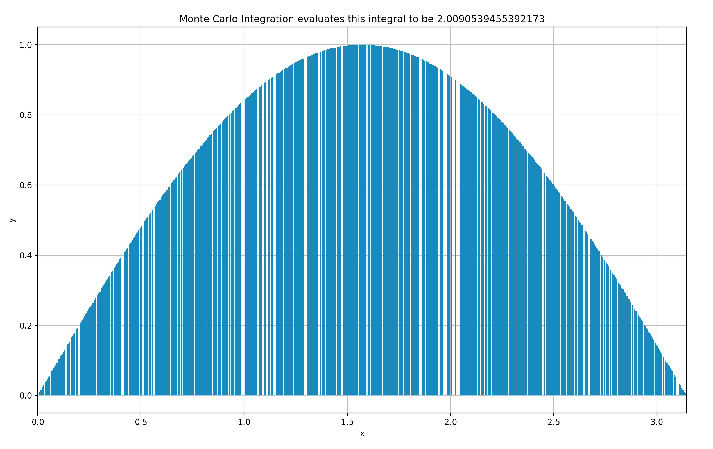
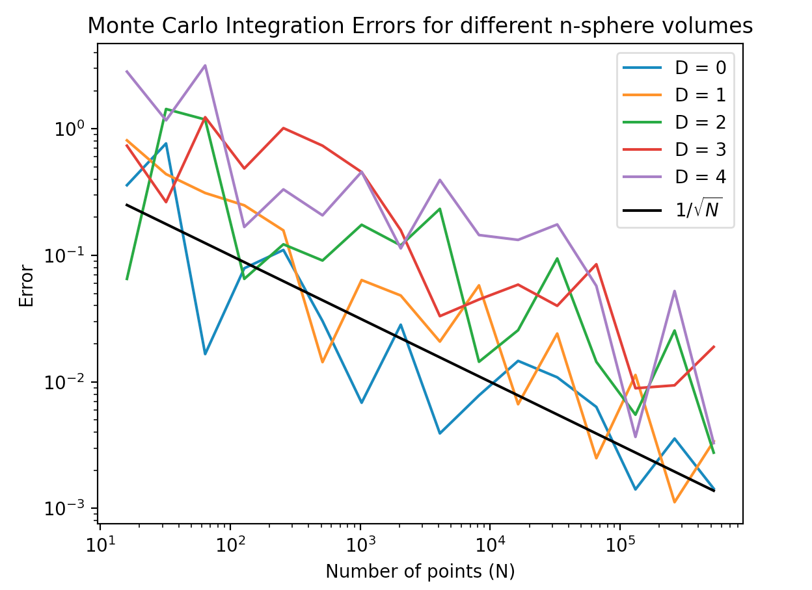

# Monte Carlo Simulations

## Monte Carlo Integration (one dimension)
This is a numerical method based on the relationship between the mean value of a function over an interval [a,b], and the integal of the function over the same interval. For a sufficiently large N,

Using this to numerically integrate sin(x) using 1000 x-values:

The code for generating this figure can be found in `mc_1d/MonteCarloInt.py`.

## Volume of an n-dimensional Sphere (multi-dimensional)
The script `mc_n_sphere/nSphere.py` computes the volume of a sphere of radius r, living in n+1 dimensions (mathematically known as an n-sphere, Sn).

Sn = { x ϵ ℝn+1 : ||x|| = r }

Error analysis across different dimensions:
