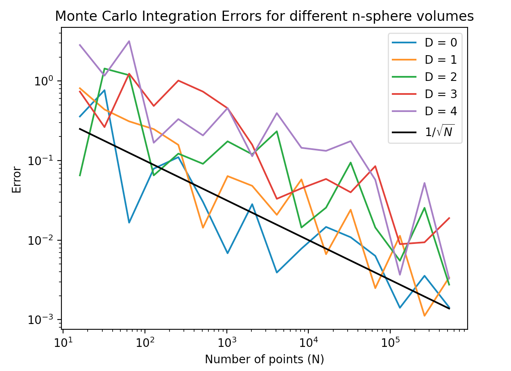

# Monte Carlo Simulations

## Volume of an n-dimensional Sphere
The script `nSpehre.py` computes the volume of a sphere of radius r, living in n+1 dimensions (mathematically known as an n-sphere, Sn).

Sn = { xϵℝn+1 : ||x|| = r }

Error analysis across different dimensions:
