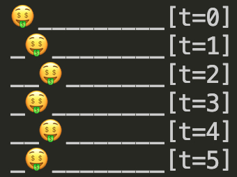

# Welcome to Project Iterra

This is a collection of programs that model different mathematical phenomena. To quickly find the right file, just look up the file name below and put it in the repo's 'Go to file' button on top.

## p-Norms in different Lebesgue space

See `pNorms` directory [here](pNorms) for more details.

## Brachistochrone Plots
The Brachistochrone curve solves a problem posed by Jean Bernoulli in 1696. The problem translates to:

"If two points A and B are given in a vertical plane, to assign a mobile particle Mthe path AMB along which, descending under
its own weight, it passes from the point A to B in the **briefest possible time**."1

The code in `brachistochrone.py` plots the brachistochrone curves from A(0,0) to several different B locations.

## Brownian Motion using the Weiner Process
The random, jittery movement of dust particles suspended in a fluid, first noticed by Robert Brown and explained by Albert Einstein, can be attributed to random collisions with air molecules in all directions. According to the Weiner Process, since most of the collisions tend to cancel eachother out, the net impulse on the dust particle can be modelled to be normally distributed about 0.2

The dust particle starts at the red dot and ends at the cyan dot.

The code used to generate this path can be found in `Brownian.py`.

## Legendre Polynomials
The first 5 solutions to [Legendre's differential equation](https://en.wikipedia.org/wiki/Legendre_polynomials#Definition_via_differential_equation).

The first plot renders the polynomial expansion of these solutions as a function of x, while the second plot renders them as functions of the trigonometric (sin(x), cos(x) & tan(x)) and hyperbolic (sinh(x), cosh(x) & tanh(x)) functions. The code is in `LegendrePoly.py`

## Random Walk with partially reflecting boundaries
Our agent, 🤑, is on a street. It lives in a world where time is discrete. Each second it has a probability p of moving right, and 1-p of moving left. If it reaches an end of a street, it will stay there until it is fortunate enough to take a step away from the boundary.3

## The Collatz Conjecture
Start with any positive integer, \(n\). If the number is even, half it. If the number is odd, triple it and add one. The Collatz conjecture conjecture says the sequence will reach 1 for all \(n\). Why this happens is still an open problem in mathematics.

The Collatz conjecture has been modelled in assembly language (Little Man Computer) - for a bit of a challenge - in `Collatz.asm`.

## Summation Formulae
These model summation formulae for constants and the first n natural numbers (along with their squares and cubes). The code can be found in `SumFormulae.py`

## Farey's Algorithm
Not the complete algorithm for generating Farey sequences, but it kind of works - there are some extra terms in the sequence it spits out. The code can be found in `Farey.py`

## Dependencies
All necessary dependencies have been included in `requirements.txt`. The file can be read to install the required dependencies into your machine or virtual environment using the following command on your command line interface (typically PowerShell or Command Prompts for Windows, Terminal for MacOS):

`pip install -r requirements.txt`

## References
1 L.N. Hand & J.D. Finch, Analytical Mechanics 1st ed. (1999)

2 R.T. Durrett, Probability Theory and Examples 5th ed. (2019)

3 G.F. Lawler, Introduction to Stochastic Processes 2nd ed. (2006)

