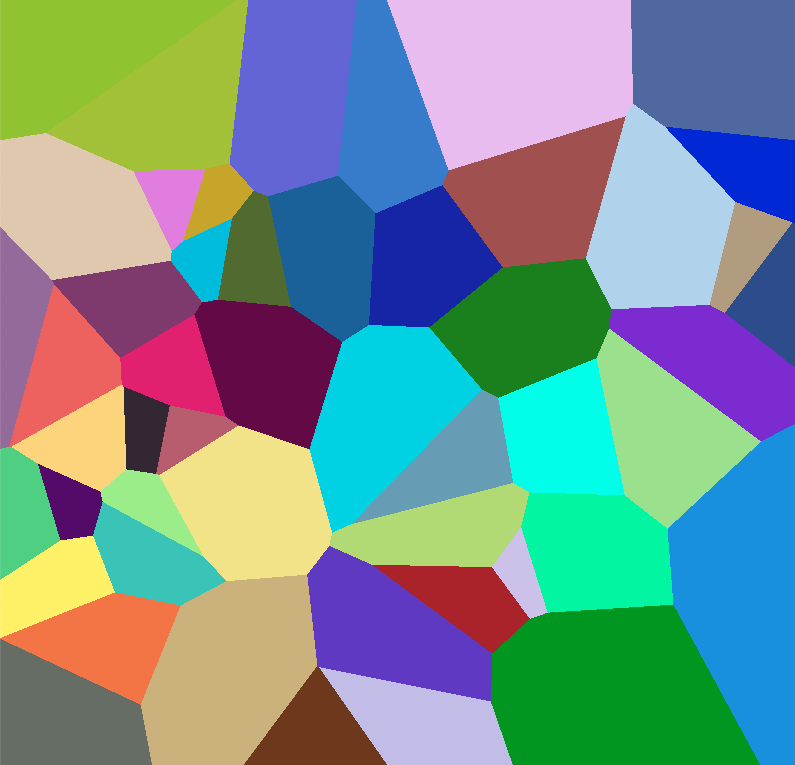
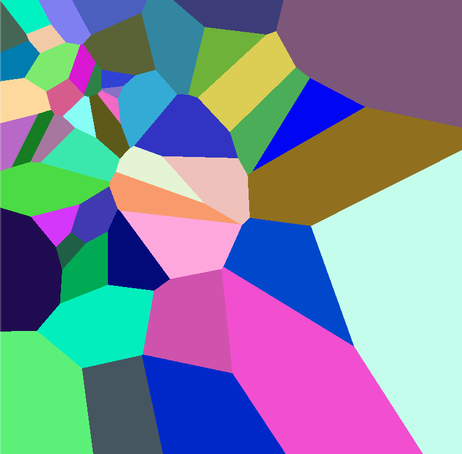
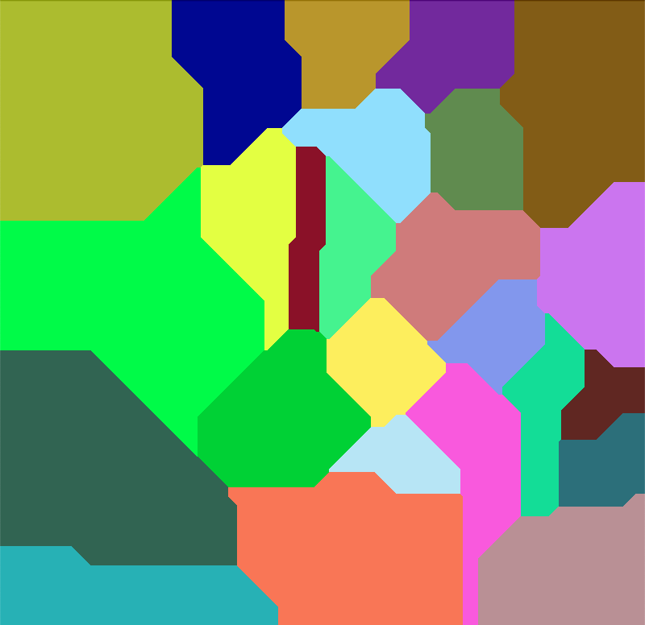

# What are Voronoi cells?
They're pretty.
## Formal Definition
For a set of N points, {P1, P2, ..., PN}, in a metric space, X, with a distance function, d, the Voronoi Cell for the kth point, Pk, is denoted Vk. It is the set of all points in X whose distance to Pk is less than its distance to any other point Pj.

Vk = {xϵX | d(x,Pk) < d(x,Pj) ∀ j ≠ k}

## 5-year olds' Definition
Poke a bunch of random dots in different colours onto this page.

Colour all the space close to the red dot red. Now do the same for yellow, green and all the other points. Careful - a red space means its closest dot is your red dot.

Now go outside and play.

# Results
Voronoi diagrams for 5, 10 and 50 cells (top to bottom) with centres uniformly distributed across the 800x800 plane. Euclidean distance was used as the metric.

  

    
  

  

    
  

  

    
  

<!-- 

 -->

If we have a gaussian distribution of centres:

If we use Manhattan distance as the metric, with 25 cells:

# Future Work
* Rectangular plots to generate wallpapers
* Maybe a heuristic method to determine nearest Pk to a given pixel?